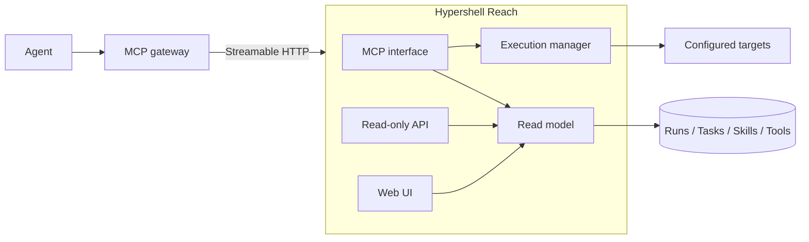

# Hypershell Reach

Hypershell Reach is the capability layer between agents and their environment. It gives agents governed access to tools, scripts, skills, execution, Runs and Task continuity without coupling the product to one agent or one MCP gateway.

## Architecture

Reach is a modular monolith delivered as one long-lived service and one container.



Accepted `start_*` executions are owned by the long-lived Reach process rather than the individual MCP request. A tunnel or client request can therefore end while the Run continues. Reach deliberately does not add an external queue, worker fleet or database.

## HTTP surface

The service listens on one HTTP port:

- `/mcp` — Streamable HTTP MCP endpoint;
- `/api/v1/summary` — compact product counts for dashboards such as Homepage;
- `/api/v1/skills`, `/api/v1/tools`, `/api/v1/tasks`, `/api/v1/runs` — bounded read-only inventory;
- `/` and product views — read-only Web UI;
- `/healthz` — health endpoint.

The read-only HTTP surface never exposes SSH addresses, credentials, command bodies, command output or full Task continuity state.

## Configuration

Reach reads one YAML configuration selected by `REACH_CONFIG`.

```yaml
schema_version: 1
workspace:
  tmp: /var/tmp/reach
  runs: /var/lib/reach/runs
  tasks: /var/lib/reach/tasks
  trash: /var/lib/reach/trash

defaults:
  max_timeout_seconds: 300
  max_synchronous_timeout_seconds: 90

executor:
  max_concurrency: 2

sources:
  tools:
    - id: reach
      type: bundled
      enabled: true

targets:
  example:
    display_name: Example host
    capabilities: [linux, bash]
    ssh:
      host: 192.0.2.10
      user: operator
      identity_file: /run/secrets/reach/id_ed25519
      known_hosts_file: /run/secrets/reach/known_hosts
```

Validate before deployment:

```bash
REACH_CONFIG=/path/to/reach.yaml reach validate
```

Start the service:

```bash
REACH_CONFIG=/path/to/reach.yaml reach --host 0.0.0.0 --port 8080
```

See [Configuration](docs/configuration.md) and [Installation](docs/installation.md).

## Capabilities

Reach provides configured target discovery, managed tools/scripts, bounded synchronous execution, durable asynchronous Runs, Task continuity, Agent Skills discovery and governed tooling Candidates. The exact MCP tool contracts are documented in [Tools](docs/tools.md), [Runs and Tasks](docs/runs-and-tasks.md) and [Skills](docs/skills.md).

Reach does not authorize an agent to perform a change. Caller and gateway policy remain responsible for authorization. See [Security](docs/security.md).

## Deployment

The maintained deployment model is one Reach container. MCPJungle connects to `/mcp`; a reverse proxy may expose the Web UI; Homepage may consume `/api/v1/summary`. Deployment-specific targets, paths, secrets and private source mounts stay outside this repository.

See [Architecture](docs/architecture.md), [MCPJungle](docs/mcpjungle.md) and [Web UI](docs/web-ui.md).

## Development and releases

Use the repository's frozen test and browser-acceptance entrypoints. Releases provide a wheel, source distribution and checksums. See [Development](docs/development.md), [Release lifecycle](docs/releasing.md), [Contributing](CONTRIBUTING.md) and [License](LICENSE).
