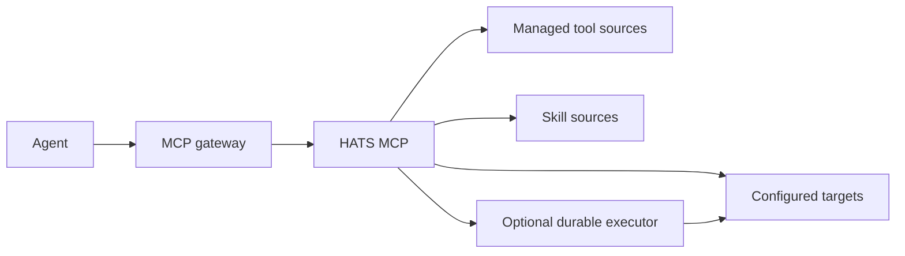

# HATS

Homelab Agent Tooling & Skills MCP provides reusable agent tooling, bounded remote execution and shared skill discovery for homelabs.

> Pre-release project. Interfaces may change before the first stable release.

## What it is

HATS is a small MCP service for capabilities that are specific to a homelab and are not already provided by an upstream MCP server.



The current implementation provides configured targets, bounded SSH execution, registry-backed managed scripts, persistent Run purpose and bounded result metadata, durable asynchronous execution for work that can outlive an MCP request, task continuity, progressive read-only Agent Skills discovery, tooling-candidate visibility and an optional read-only Web UI with integrated documentation.

## Design

HATS is a modular monolith. Deployment-specific hosts, paths and source locations stay in external configuration. The repository contains no deployment-specific configuration or private homelab data. A private deployment should normally keep that configuration and any private managed-tool extensions in its existing infrastructure/configuration source rather than creating a dedicated HATS overlay repository solely for privacy.

See [Architecture](docs/architecture.md) for module boundaries and delivery phases.

## Installation

HATS releases provide a wheel, source distribution and SHA-256 manifest through GitHub Releases. Install an exact verified release artifact for maintained deployment; use a reviewed checkout only for development or transition work.

Then validate the deployment before adding it to an MCP client:

```bash
HATS_CONFIG=/path/to/hats.yaml hats-mcp validate
```

See [Installation](docs/installation.md) for upgrade and source-pin guidance.

## Configuration

HATS reads one YAML configuration file selected by `HATS_CONFIG`.

```yaml
schema_version: 1
workspace:
  tmp: /var/tmp/hats
  runs: /var/lib/hats/runs
  tasks: /var/lib/hats/tasks
  trash: /var/lib/hats/trash

defaults:
  max_timeout_seconds: 300
  max_synchronous_timeout_seconds: 90

executor:
  socket_path: /run/hats/executor.sock

sources:
  tools:
    - id: hats
      type: bundled
      enabled: true
    - id: local
      type: filesystem
      path: /sources/local-tools
      enabled: true

targets:
  example:
    display_name: Example host
    transport: ssh
    capabilities: [linux, bash]
    ssh:
      host: 192.0.2.10
      user: operator
      identity_file: /run/secrets/hats/id_ed25519
      known_hosts_file: /run/secrets/hats/known_hosts
```

The `bundled` source enables standard managed tools shipped with the installed HATS package. Additional deployment-owned tools can be added through filesystem sources.

See [Configuration](docs/configuration.md) and [`examples/config.example.yaml`](examples/config.example.yaml).

Before connecting HATS to an MCP client, validate the local deployment:

```bash
HATS_CONFIG=/path/to/hats.yaml hats-mcp validate
```

`validate` is an operator-facing preflight. It shows configured target names and hosts, workspace readiness, source paths and SSH credential paths without printing credential contents or making network connections.

## MCP surface

HATS currently exposes:

- `list_targets`
- `list_scripts`
- `get_script`
- `run_script` / `start_script`
- `run_command` / `start_command`
- `run_shell` / `start_shell`
- `cancel_run`
- `list_runs`
- `get_run`
- `set_run_retained`
- `list_tasks`
- `get_task`
- `create_task`
- `update_task`
- `close_task`
- `archive_task`
- `skills_catalog` — compact live tier-1 discovery
- `skill_get` — bounded selected skill content
- `skill_read_file` — bounded supporting-file retrieval
- `tooling_candidates` — backward-compatible read-only legacy candidate view
- `preview_candidate_imports` — map legacy explicit candidates to Candidate v1 drafts without mutation
- `list_candidates` / `get_candidate` — structured HATS-owned Candidate state
- `create_candidate` / `update_candidate` — typed Candidate proposal mutation with revision CAS
- `approve_candidate` / `block_candidate` / `mark_candidate_not_warranted` — explicit lifecycle transitions
- `link_candidate_task` — link an approved Candidate to an existing HATS Task
- `complete_candidate` — record an implemented or automated outcome and final capability reference

Skill content remains read-only and never becomes executable tooling automatically.

See [Tool contracts](docs/tools.md), [Skills](docs/skills.md) and the optional [MCPJungle example](docs/mcpjungle.md).

## Web UI

The optional `hats-ui` runtime provides a read-only browser view for Overview, Targets, Tooling, Runs, Tasks, Skills and Documentation. Tooling combines managed tools with reviewed tooling candidates. Documentation includes a plain-language [User guide](docs/user-guide.md) and renders the maintained technical Markdown from this repository inside the UI.

The browser role does not add execution or state-mutation capability. See [Web UI](docs/web-ui.md) for the runtime, information and HTTP boundaries.

## Security

HATS does not authorize an agent to perform a change. It provides bounded execution and managed capability discovery. The caller remains responsible for deciding whether an operation is authorized.

See [Security](docs/security.md).

## Project governance

- [Contributing](CONTRIBUTING.md) explains the contribution boundary.
- [Repository agent guide](AGENTS.md) defines instructions for coding agents working in this repository.
- [Tooling lifecycle](docs/tooling-lifecycle.md) defines how recurring gaps become reusable tooling without creating unnecessary helpers.
- [Release lifecycle](docs/releasing.md) defines versioning, tagging and release acceptance.
- [License](LICENSE) contains the MIT license text.

## Development

See [Development](docs/development.md).
