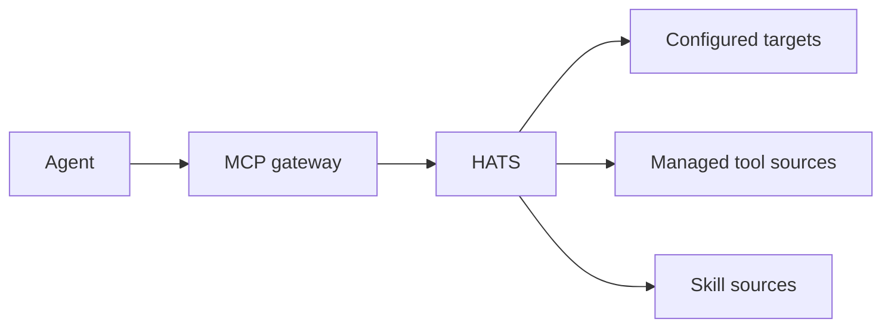

# HATS

Homelab Agent Tooling & Skills MCP provides reusable agent tooling, bounded remote execution and shared skill discovery for homelabs.

> Pre-release project. Interfaces may change before the first stable release.

## What it is

HATS is a small MCP service for capabilities that are specific to a homelab and are not already provided by an upstream MCP server.



The current implementation provides configured targets, bounded SSH execution, registry-backed managed scripts, persistent run metadata and task continuity. Skills are added as a separate module on the same service.

## Design

HATS is a modular monolith. Deployment-specific hosts, paths and source locations stay in configuration. The repository contains no deployment-specific configuration or private homelab data.

See [Architecture](docs/architecture.md) for module boundaries and delivery phases.

## Configuration

HATS reads one YAML configuration file selected by `HATS_CONFIG`.

```yaml
schema_version: 1
workspace:
  tmp: /var/tmp/hats
  tasks: /var/lib/hats/tasks
  trash: /var/lib/hats/trash

sources:
  tools:
    - id: local
      type: filesystem
      path: /sources/local-tools

targets:
  example:
    display_name: Example host
    transport: ssh
    capabilities: [linux, bash]
    ssh:
      host: 192.0.2.10
      user: operator
      identity_file: /run/secrets/hats/id_ed25519
      known_hosts_file: /run/secrets/hats/known_hosts
```

See [Configuration](docs/configuration.md) and [`examples/config.example.yaml`](examples/config.example.yaml).

## MCP surface

HATS currently exposes:

- `list_targets`
- `list_scripts`
- `get_script`
- `run_script`
- `list_runs`
- `get_run`
- `set_run_retained`
- `list_tasks`
- `get_task`
- `create_task`
- `update_task`
- `archive_task`
- `run_command`
- `run_shell`

The skills phase adds Agent Skills without turning skill content into executable tooling.

See [Tool contracts](docs/tools.md) and [Skills](docs/skills.md).

## Security

HATS does not authorize an agent to perform a change. It provides bounded execution and managed capability discovery. The caller remains responsible for deciding whether an operation is authorized.

See [Security](docs/security.md).

## Development

See [Development](docs/development.md).
