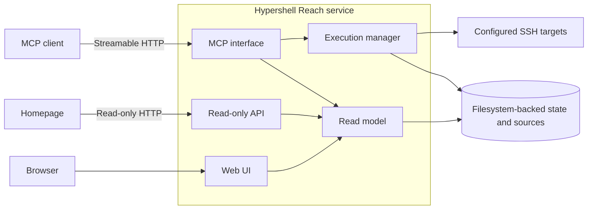

# Architecture

Hypershell Reach is the capability layer between agents and their environment. It is a modular monolith with one long-lived deployment process.

## Runtime

MCP, API, UI and asynchronous execution share one package, configuration and lifecycle. They are modules, not independent services. Reach requires no external queue, worker service or database.

## Request and execution lifetimes

Synchronous `run_*` operations are bounded by `max_synchronous_timeout_seconds`. Longer work uses `start_*` and returns a Run ID quickly.

The execution manager creates an independent asyncio Task in the long-lived Reach process. Once accepted, that work is not owned by the MCP request, client session, MCPJungle request or OpenAI tunnel command. Request cancellation therefore does not cancel an accepted Run.

A Reach process restart is a different boundary. Raw command/script content is intentionally not persisted, so interrupted asynchronous work is not replayed automatically. On startup, stale asynchronous Runs are reconciled as interrupted instead of being guessed or duplicated.

## Modules

| Module | Responsibility |
| --- | --- |
| Configuration | Validate deployment-owned targets, source roots, limits and workspace paths. |
| MCP | Expose governed capability contracts over Streamable HTTP. |
| Execution manager | Own accepted asynchronous work and bounded concurrency. |
| SSH execution | Run non-interactive work with strict host keys, key-only auth, no PTY/forwarding, bounded timeout/output and no automatic retry. |
| Managed tools | Resolve reviewed script IDs, metadata, arguments and target capabilities. |
| Runs | Persist safe execution metadata without raw command/script/output content. |
| Tasks | Persist bounded cross-session work continuity. |
| Skills | Discover read-only Agent Skills from configured sources. |
| Candidates | Govern reusable tooling proposals and promotion state. |
| Read model | Sanitize and cache read-only product views for UI/API consumers. |
| Web UI | Present operational state without adding browser mutation capability. |
| Read-only API | Expose bounded inventories and summary counts for trusted internal consumers. |

## State boundary

Runs, Tasks and Candidates remain filesystem-backed. Tool and skill sources remain deployment-owned. Reach does not take ownership of Git, CIFS, rsync or other source-delivery mechanisms.

The Web UI and HTTP API use explicit read-only stores. They do not reconcile Runs, repair Tasks or execute remote work.

## Product boundary

The repository owns generic product code, schemas, examples, tests and documentation. Deployment-specific configuration, SSH credentials, target inventory and private tools remain outside the product repository.

This boundary is intentionally broader than MCP. MCP is one interface to Reach; it is not the product identity.
