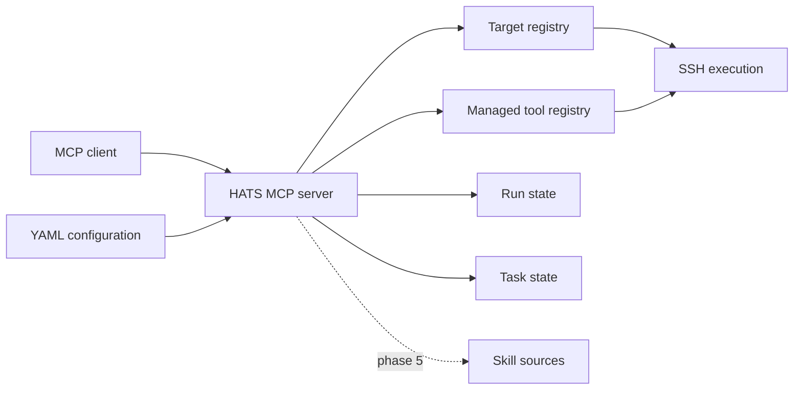
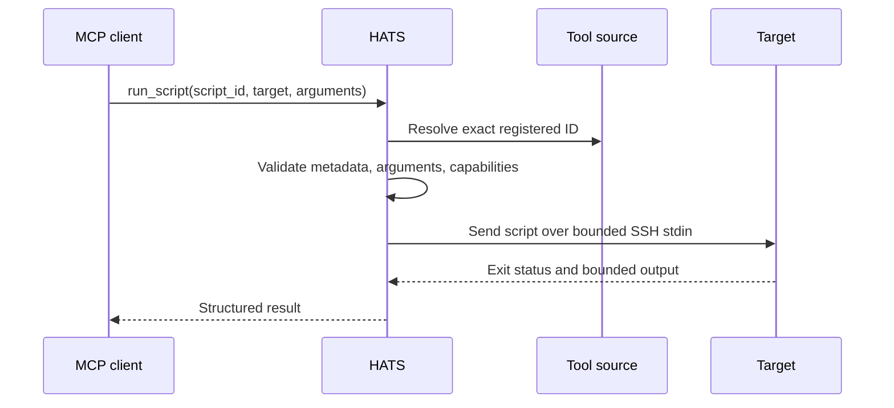
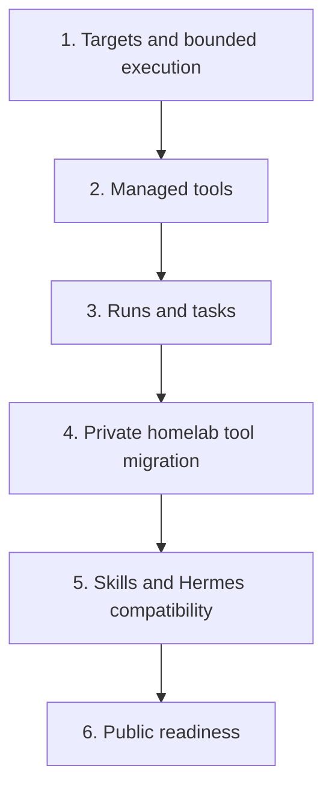
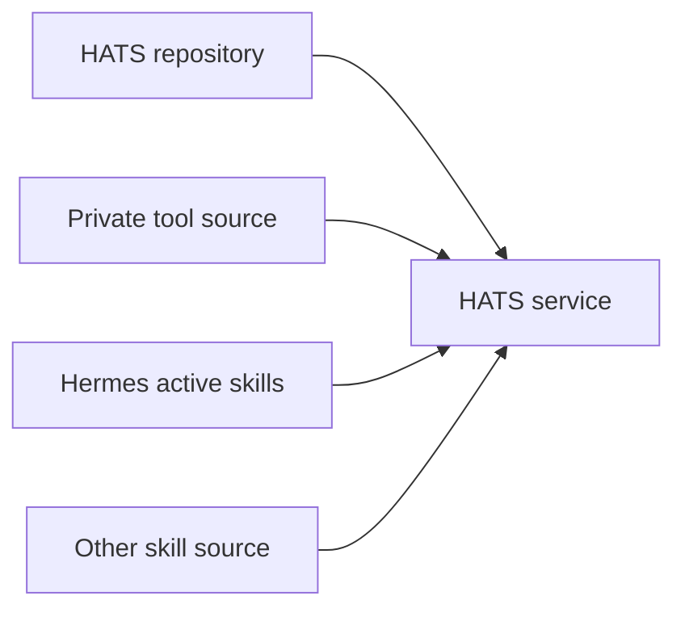

# Architecture

HATS is a modular MCP service for reusable homelab agent capabilities. It keeps deployment configuration outside the repository and adds modules only when they solve a concrete use case.

## Overview

One process owns configuration, target lookup, tool discovery and local state. HATS does not require a separate controller, database server or worker service.

## Modules

| Module | Responsibility |
| --- | --- |
| Configuration | Validate deployment-specific targets, source roots and workspace paths. |
| Targets | Return safe target metadata and resolve one configured execution target. |
| SSH execution | Run bounded non-interactive commands or interpreter input on configured targets. |
| Managed tools | Discover approved metadata and execute only registered script IDs. |
| Runs | Record technical execution state and ambiguous/interrupted outcomes. |
| Tasks | Keep durable continuity only for work that needs recovery or handoff. |
| Skills | Discover and retrieve read-only Agent Skills from configured sources. |

## Managed tool execution

Tool source delivery is external to HATS. A target does not need the source repository or script installed locally.

## Delivery phases

Each phase must leave the service usable. Later modules must not weaken the execution boundary established in phase 1.

## Source boundary

The HATS repository owns generic product code, schemas, examples and tests. Homelab-specific tools and skills can live in separate repositories or mounted directories.

HATS consumes configured filesystem sources. It does not own their Git, rsync or mount lifecycle.

## Execution boundary

The caller selects a configured target. Target configuration owns host, port, user, identity, known-hosts file and execution limits.

SSH execution is non-interactive and uses strict host-key checking, key-only authentication, no PTY, no forwarding, bounded output, bounded timeout and no automatic retry.

A failed or interrupted mutation can leave remote state ambiguous. HATS must report that ambiguity; it must not claim rollback or safe retry without evidence.

## Skills boundary

Skills are read-only instructions and supporting files. A script stored inside a skill package is still skill content. It does not become a managed HATS tool automatically.

The Hermes source adapter will mirror Hermes' effective skill catalog rather than only scanning directories. This includes enable/disable state and supported provenance while keeping Hermes as the authority for its own skills.
