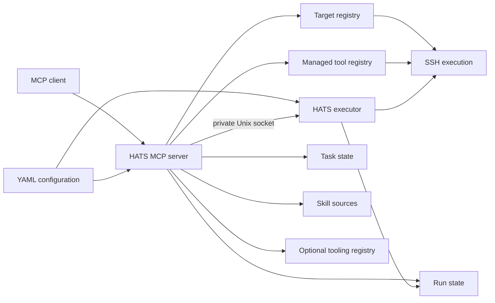
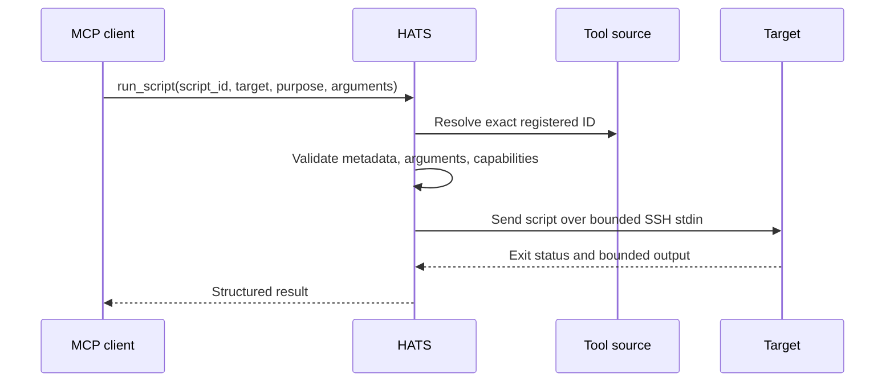
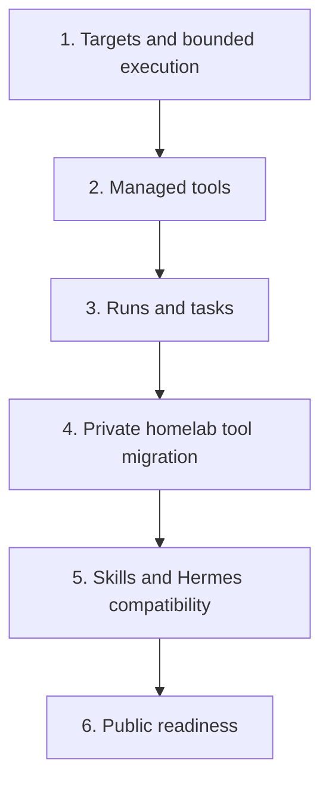
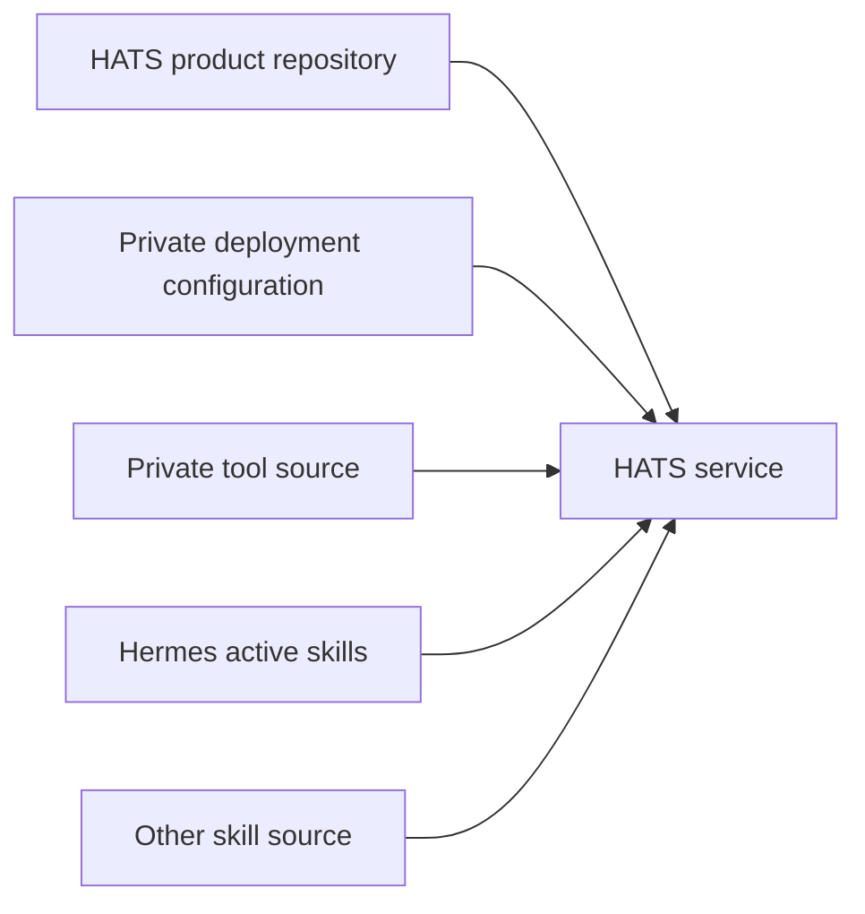

# Architecture

HATS is a modular MCP service for reusable homelab agent capabilities. It keeps deployment configuration outside the repository and adds modules only when they solve a concrete use case.

## Overview



HATS remains a small product with filesystem-backed state and no external queue or database. The MCP runtime owns discovery, synchronous calls and client-facing state operations. When durable asynchronous execution is configured, one separately supervised `hats-executor` process owns accepted async SSH work through a private Unix socket. This separation is required so accepted work can outlive an MCP STDIO child or gateway request without introducing a general-purpose orchestration platform.

## Modules

| Module | Responsibility |
| --- | --- |
| Configuration | Validate deployment-specific targets, source roots and workspace paths. |
| Targets | Return safe target metadata and resolve one configured execution target. |
| SSH execution | Run bounded non-interactive commands or interpreter input on configured targets. |
| Durable executor | Own accepted asynchronous Runs independently of MCP request lifetime with bounded local submission and concurrency. |
| Managed tools | Discover approved metadata and execute only registered script IDs. |
| Runs | Record agent purpose, bounded technical result context and ambiguous/interrupted execution outcomes without persisting raw execution content. |
| Tasks | Keep durable continuity only for work that needs recovery or handoff. |
| Skills | Discover and retrieve read-only Agent Skills from configured sources. |
| Candidates | Validate and durably mutate typed Candidate YAML state with revision CAS and per-Candidate locking when Candidate storage is configured. |
| Tooling registry | Preserve the optional deployment-owned Markdown registry as a read-only compatibility feed and import-preview source. |

## Managed tool execution



Tool source delivery is external to HATS. A target does not need the source repository or script installed locally.

## Delivery phases



Each phase must leave the service usable. Later modules must not weaken the execution boundary established in phase 1.

## Source boundary

The HATS repository owns generic product code, schemas, examples and tests. Deployment-specific non-secret configuration, target inventory and private managed-tool or skill sources stay outside the product repository and should normally be owned by the deployment's existing private infrastructure or configuration source.

A deployment does not need a dedicated private HATS overlay repository merely to keep configuration private. Use a separate private repository only when an independent lifecycle, ownership or security boundary requires one.



HATS consumes configured filesystem sources. It does not own their Git, rsync or mount lifecycle.

## Optional web UI

HATS includes an optional Web UI in the same product repository and release rather than as a separate product. The MCP and UI are separate runtime roles:

```text
hats-mcp       # STDIO MCP entrypoint, for example as an MCP gateway child
hats-executor  # optional separately supervised durable async execution runtime
hats-ui        # optional HTTP entrypoint in a separate long-running container/process
```

The UI is read-only and reuses the HATS domain models and configured state through explicit read-only store access. It does not reconcile Runs, perform retention cleanup, mutate Tasks or project remote Hermes state. Its browser surface combines operational views with a user guide and curated technical documentation rendered from the repository Markdown packaged in the same release. Tooling candidates are presented inside the Tooling product area rather than as a separate primary destination.

Do not run the long-lived executor or HTTP listener as an incidental child of a STDIO gateway request lifecycle. The executor must be supervised independently of `hats-mcp`. If browser mutations are added later, establish one explicit writer/service boundary instead of letting independent MCP and UI processes mutate the same file-backed state concurrently.

## Execution boundary

The caller selects a configured target. Target configuration owns host, port, user, identity, known-hosts file and execution limits.

SSH execution is non-interactive and uses strict host-key checking, key-only authentication, no PTY, no forwarding, bounded output, bounded timeout and no automatic retry. Synchronous tools are additionally bounded by a deployment-configured transport-safe ceiling. Work above that ceiling uses explicit `start_*` submission and durable Run polling rather than extending an upstream MCP request lifetime.

A failed or interrupted mutation can leave remote state ambiguous. HATS must report that ambiguity; it must not claim rollback or safe retry without evidence. Persisted Run purpose explains why an agent execution exists, while the server-generated result summary provides only bounded allowlisted result metadata. Neither field weakens the existing ban on persisting raw command/script content, argument or environment values, or stdout/stderr text.

## Skills boundary

Skills are read-only instructions and supporting files. A script stored inside a skill package is still skill content. It does not become a managed HATS tool automatically.

The Hermes source adapter mirrors Hermes' effective skill catalog rather than only scanning directories. This includes enable/disable state and supported provenance while keeping Hermes as the authority for its own skills.
