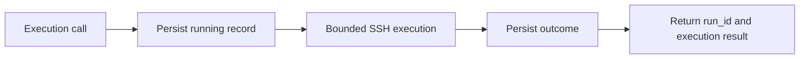
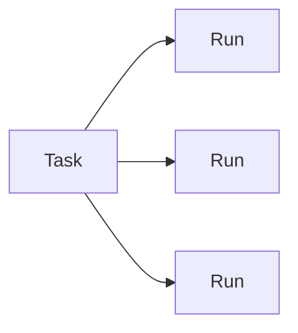

# Runs and tasks

Runs and tasks solve different problems.

## Runs

A run is one technical execution attempt. HATS creates a run immediately before `run_command`, `run_shell` or `run_script` reaches the SSH execution boundary.

Run records contain execution metadata only. They never persist:

- command text;
- shell or managed script content;
- argument values;
- stdout or stderr text;
- target addresses, users or credential paths.

A run can contain script ID, source, content hash, argument names, target ID, timestamps, exit status and output byte/truncation counters.

### States

| State | Meaning |
| --- | --- |
| `running` | Local execution attempt is in progress. |
| `succeeded` | Remote exit code was zero. |
| `remote_error` | Remote process returned a known non-zero exit code. |
| `transport_error` | SSH transport failed. |
| `timeout` | HATS killed the local SSH process after its timeout. |
| `local_error` | Execution could not start or complete because of a local HATS/runtime error. |
| `interrupted` | HATS execution was cancelled or a prior `running` record was recovered after restart. |
| `unknown` | An unexpected internal failure prevented a trustworthy terminal classification. |

For potentially mutating operations, `transport_error`, `timeout`, `interrupted` and `unknown` are marked `ambiguous=true`. HATS does not retry them automatically.

Raw `run_command` and `run_shell` are treated as potentially mutating because HATS cannot infer their semantics. Managed tools use their declared `mutating` metadata.

### Recovery

On startup, HATS changes stale `running` records to `interrupted`. This records local interruption; it does not claim the remote system rolled back or completed.

### Run tools

- `list_runs` returns bounded summaries and can filter by state or task ID.
- `get_run` returns one complete metadata record.
- `set_run_retained` sets a local retention override without executing anything remotely.

## Tasks

A task is durable continuity state for work that would be difficult to reconstruct after interruption or handoff. Ordinary commands and straightforward reproducible changes do not need a task.

A task is not the same as a project. One project can use zero or more tasks, and a task can exist without a project.

Task persistence and lifecycle tools are implemented in the next Phase 3 batch. Execution inputs already reserve an optional `task_id` so runs can be linked once that task exists.

## Retention

Retention is configuration-driven and disabled by default.

A completed run can be deleted automatically only when all conditions are true:

- it has a cleanup-eligible terminal state;
- it is older than `retention.runs.completed_days`;
- `ambiguous=false`;
- `retained=false`.

`running`, `interrupted`, `unknown` and ambiguous records are never removed by run cleanup.

Task retention applies only after task archival and is implemented with the task lifecycle.
