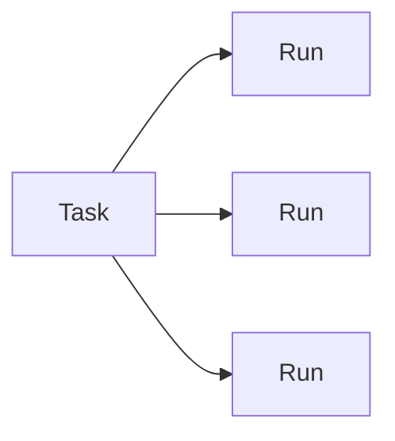

# Runs and tasks

Runs and tasks solve different problems.

## Runs

A run is one technical execution attempt. HATS creates it automatically for executable operations once run persistence is implemented.

A run records enough state to answer:

- what was invoked;
- on which target;
- when it started and ended;
- whether the result succeeded, failed, timed out or became ambiguous.

An interrupted mutation is not automatically resumable. HATS records the ambiguity so an agent can reconcile remote state before retrying.

## Tasks

A task is durable continuity state for work that would be difficult to reconstruct after interruption or handoff. Ordinary commands and straightforward reproducible changes do not need a task.

A task is not the same as a project. One project can use zero or more tasks, and a task can exist without a project.

## Retention

Retention will be configurable. Automatic cleanup applies only to terminal, reconciled state.

Running, partial, blocked or unresolved ambiguous state must not be deleted automatically.
