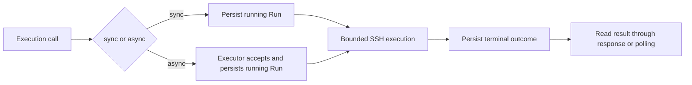
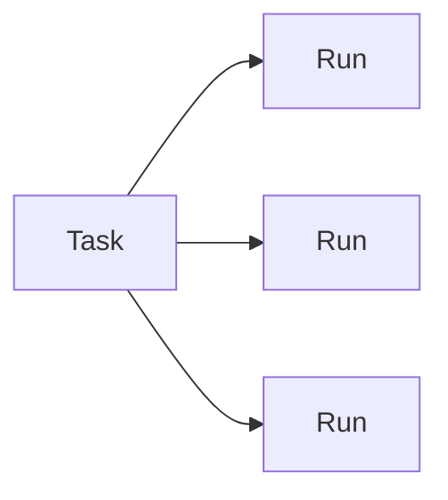

# Runs and tasks

Runs and tasks solve different problems.

## Runs

A run is one technical execution attempt. Synchronous `run_command`, `run_shell` and `run_script` create a Run immediately before the SSH execution boundary. Asynchronous `start_command`, `start_shell` and `start_script` create the Run in the durable executor when submission is accepted. New agent-initiated executions must provide a human-readable `purpose` that explains why the execution exists. Purpose is intentionally separate from the technical operation, target, managed-tool identity and execution result.



Run records contain bounded execution metadata only. They never persist:

- command text;
- shell or managed script content;
- argument values;
- environment values;
- stdout or stderr text;
- target addresses, users or credential paths.

A run can contain execution mode, purpose, script ID, source, content hash, argument names, target ID, timestamps, exit status, mutation classification, declared idempotency, output byte/truncation counters and a bounded `result_summary`. Compact run listings expose purpose, result summary, `may_mutate` and `idempotent`. Managed tools persist their declared values; raw command and shell runs keep `idempotent: null` because Hypershell Reach cannot infer repeat safety from arbitrary caller input.

### Purpose contract

`purpose` answers **why** the execution exists. It must not repeat command text, shell/script bodies, argument values, environment values, credentials, tokens or other secrets. Agent-facing execution tools require it as one printable line of 1 to 512 characters after outer whitespace is trimmed. Invalid or oversized purpose is rejected rather than truncated.

Internal RunStore callers may omit purpose when no agent intent exists. Historical Run v1 records therefore remain meaningful with `purpose: null`; Hypershell Reach never invents purpose text for them.

### Result summary contract

`result_summary` is server-generated result/diagnostic context, not caller-supplied log storage. It is built only from allowlisted metadata already inside the Run safety boundary: terminal status, exit code, configured timeout, ambiguity classification, stdout/stderr byte counts and truncation flags, or a bounded internal error type. It never includes command text, script content, argument values, environment values, or stdout/stderr content.

A persisted result summary is one printable line with a hard maximum of 512 characters. Hypershell Reach deterministically truncates an internally generated summary that would exceed the limit and appends ` [truncated]`; persisted values beyond the schema bound are rejected. This does not create a second receipt, log or artifact repository: the Run remains the execution receipt.

### Schema compatibility

New Run writes use schema v3. The reader accepts Run v1, v2 and v3, so existing stores require no bulk migration for forward operation. Run v1 has no purpose or result summary; Run v1 and v2 have no persisted `execution_mode` and are projected as `sync`. Historical records are not implicitly rewritten. Schema v3 is intentionally explicit because executor ownership is durable state, not an in-memory transport detail.

### States

| State | Meaning |
| --- | --- |
| `running` | Local execution attempt is in progress. |
| `succeeded` | Remote exit code was zero. |
| `remote_error` | Remote process returned a known non-zero exit code. |
| `transport_error` | SSH transport failed. |
| `timeout` | Hypershell Reach killed the local SSH process after its timeout. |
| `local_error` | Execution could not start or complete because of a local Hypershell Reach/runtime error. |
| `interrupted` | Hypershell Reach execution was cancelled or a prior `running` record was recovered after restart. |
| `unknown` | An unexpected internal failure prevented a trustworthy terminal classification. |

For potentially mutating operations, `transport_error`, `timeout`, `interrupted` and `unknown` are marked `ambiguous=true`. Hypershell Reach does not retry them automatically.

Raw `run_command` and `run_shell` are treated as potentially mutating because Hypershell Reach cannot infer their semantics. Managed tools use their declared `mutating` metadata.

### Recovery

Recovery is ownership-specific. The MCP runtime reconciles only stale synchronous `running` records as `interrupted` with `ServerRestart`; the separately supervised executor reconciles only stale asynchronous `running` records with `ExecutorRestart`. Starting or reconnecting one runtime cannot interrupt work owned by the other. This records local interruption only; it does not claim the remote system rolled back or completed.

### Run tools

- `list_runs` returns bounded summaries and can filter by state or task ID.
- `get_run` returns one complete metadata record.
- `set_run_retained` sets a local retention override without executing anything remotely.
- `cancel_run` explicitly cancels one running async Run through the executor and requires confirmation.

Run mutations from the MCP and executor processes are serialized through one fixed advisory write lock in the Run root. Writes remain atomic replacements; the fixed lock prevents cross-process lost updates without introducing a database or an unbounded lockfile set.

## Tasks

A Task is durable continuity state for work that would be difficult to reconstruct after interruption or handoff. Ordinary commands and straightforward reproducible changes do not need a Task. A Task is not authorization and is not a project-management record.



Runs persist `task_id`; Tasks do not persist a backlink list. Reverse Task-to-Run views are therefore derived from Run records.

### Storage and schema

The active and archive roots are configured independently through the backward-compatible `workspace.tasks` and `workspace.trash` keys. A deployment may bind them to paths such as:

```text
appdata/reach/tasks/
├── active/
│   ├── .locks/
│   └── <task-id>/task.yaml
└── archive/
    └── <task-id>/task.yaml
```

`.locks/` is store metadata, not Task state. New Tasks do not create `evidence/` directories. Task YAML never persists physical storage paths, secrets, or Run backlinks.

Task v2 adds a monotonic `revision`; new records start at revision `1`. Existing Task v1 records remain readable without being rewritten and are projected as revision `0` in memory. The first successful mutation of a v1 record writes Task v2 and advances its revision. Unknown persisted fields fail validation.

The `continuity` snapshot remains bounded and replaceable. It can hold authorization context, authoritative sources, completed material work, validation, cleanup, recovery, blockers and material assumptions. It is intended for safe resume or handoff, not command history.

### Mutation concurrency and durability

Task mutations use a narrowly scoped per-Task interprocess lock. `expected_revision` provides compare-and-swap semantics for callers that perform read-modify-write operations: a stale revision is rejected and cannot overwrite a newer committed Task state. The field remains optional on `update_task` and `close_task` for compatibility with the pre-v2 MCP input contract; compatibility calls are still serialized and apply typed partial mutations rather than arbitrary document replacement.

Every Task YAML mutation writes a complete validated record to a temporary file inside the same Task directory, fsyncs the file, atomically replaces `task.yaml`, and fsyncs the containing directory. Creation additionally fsyncs the active root. A close writes and fsyncs the final terminal record before the directory move, then atomically moves the Task directory on the same filesystem and fsyncs both active and archive roots. Malformed Task-shaped filesystem entries and duplicate Task IDs across roots fail safe.

### States and closure

Task states are `active`, `partial`, `blocked`, `completed` and `cancelled`. Only `active`, `partial` and `blocked` may remain in the active Task root after normal operation or startup recovery. Only open Tasks accept new linked Runs.

`close_task` is the explicit terminal boundary. It owns the status transition, final metadata update, durable Task record and active-to-archive move. For backward compatibility, `update_task` with `status=completed|cancelled` enters the same close boundary, and `archive_task` remains an idempotent compatibility helper for already-terminal callers. A successful close therefore never requires a second caller-controlled step.

A retry of the same close request returns the committed archived record without incrementing the revision again. If the final terminal YAML committed but the directory move was interrupted, retry completes the move. If the rename committed but root-directory fsync failed, retry re-establishes the required fsync boundary. Conflicting terminal outcomes fail rather than silently rewriting final state.

On writable server startup Hypershell Reach runs Task repair before retention. Terminal residue in the active root is completed into the archive root; `active`, `partial` and `blocked` records are not moved. Duplicate IDs or malformed records stop repair rather than guessing.

### Task tools

- `list_tasks` returns bounded current Tasks and can optionally include archived Tasks.
- `get_task` returns one current or archived Task.
- `create_task` creates Task v2 continuity state without executing remotely.
- `update_task` applies a typed partial update and supports `expected_revision` CAS. A terminal status uses the close boundary.
- `close_task` atomically closes and archives a Task from the caller perspective.
- `archive_task` is retained for backward compatibility with the former two-step lifecycle.

## Retention

Retention is configuration-driven and disabled by default.

A completed Run can be deleted automatically only when all conditions are true:

- it has a cleanup-eligible terminal state;
- it is older than `retention.runs.completed_days`;
- `ambiguous=false`;
- `retained=false`.

`running`, `interrupted`, `unknown` and ambiguous Run records are never removed by Run cleanup.

Task retention considers only records physically present in the archive root. A Task can be deleted only when it is terminal, has a valid `archived_at`, has `retained=false`, and is older than `retention.tasks.archived_days`. `active`, `partial` and `blocked` Tasks are never deleted by Task retention, even if they are old or misplaced.

## Task storage migration

The public migration helper implements the copy-and-validate portion of a governed deployment migration. It computes a deterministic source preimage, validates record counts and duplicate IDs, byte-copies Task YAML, routes terminal active residue into the target archive, omits only empty legacy `evidence/` directories, preserves and reports every non-empty legacy `evidence/` tree, revalidates the unchanged source, and validates the target before reporting `switch_ready=true`.

It never edits deployment configuration, retires the source roots, or performs a live switch. The deployment gate must quiesce writers, establish the exact preimage, run copy/validate, change the configured roots, start the compatible Hypershell Reach build against the target roots, validate Task and Run relationships, and keep the legacy source roots available until rollback is no longer required. See [Task storage migration](task-storage-migration.md).
