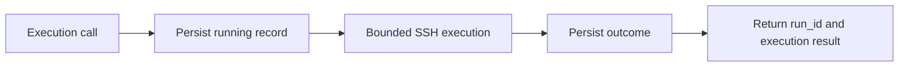
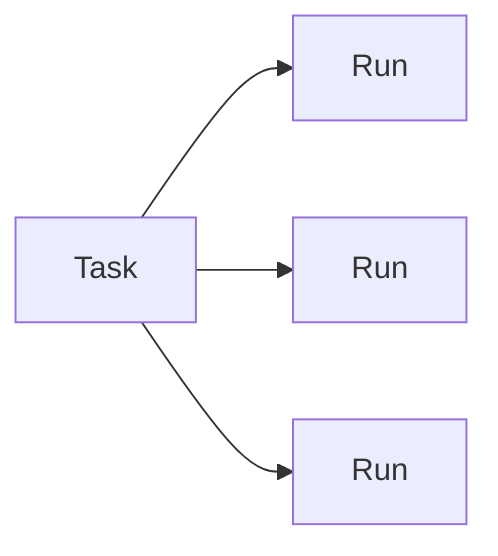

# Runs and tasks

Runs and tasks solve different problems.

## Runs

A run is one technical execution attempt. HATS creates a run immediately before `run_command`, `run_shell` or `run_script` reaches the SSH execution boundary.



Run records contain execution metadata only. They never persist:

- command text;
- shell or managed script content;
- argument values;
- stdout or stderr text;
- target addresses, users or credential paths.

A run can contain script ID, source, content hash, argument names, target ID, timestamps, exit status, mutation classification, declared idempotency and output byte/truncation counters. Compact run listings expose both `may_mutate` and `idempotent`. Managed tools persist their declared values; raw command and shell runs keep `idempotent: null` because HATS cannot infer repeat safety from arbitrary caller input.

### States

| State | Meaning |
| --- | --- |
| `running` | Local execution attempt is in progress. |
| `succeeded` | Remote exit code was zero. |
| `remote_error` | Remote process returned a known non-zero exit code. |
| `transport_error` | SSH transport failed. |
| `timeout` | HATS killed the local SSH process after its timeout. |
| `local_error` | Execution could not start or complete because of a local HATS/runtime error. |
| `interrupted` | HATS execution was cancelled or a prior `running` record was recovered after restart. |
| `unknown` | An unexpected internal failure prevented a trustworthy terminal classification. |

For potentially mutating operations, `transport_error`, `timeout`, `interrupted` and `unknown` are marked `ambiguous=true`. HATS does not retry them automatically.

Raw `run_command` and `run_shell` are treated as potentially mutating because HATS cannot infer their semantics. Managed tools use their declared `mutating` metadata.

### Recovery

On startup, HATS changes stale `running` records to `interrupted`. This records local interruption; it does not claim the remote system rolled back or completed.

### Run tools

- `list_runs` returns bounded summaries and can filter by state or task ID.
- `get_run` returns one complete metadata record.
- `set_run_retained` sets a local retention override without executing anything remotely.

## Tasks

A task is durable continuity state for work that would be difficult to reconstruct after interruption or handoff. Ordinary commands and straightforward reproducible changes do not need a task.



A task is not the same as a project. One project can use zero or more tasks, and a task can exist without a project.

Task state is stored as:

```text
tasks/<task-id>/
├── task.yaml
└── evidence/
```

`task.yaml` keeps the compact task identity and one replaceable `continuity` snapshot. The snapshot can hold bounded authorization context, authoritative sources, completed material work, validation, cleanup, recovery, blockers and material assumptions. Each assumption records its statement, evidence class, impact if wrong and bounded decision. This is intended for safe resume or handoff, not command history or project management.

`update_task` replaces the supplied continuity snapshot rather than accumulating checkpoints. This keeps current state compact and lets callers remove obsolete handoff information deliberately. Older v1 task records without `continuity` remain valid and load with an empty snapshot.

HATS creates the evidence directory as a bounded place for deployment-specific evidence workflows. The v1 MCP surface does not provide an arbitrary evidence-file writer.

Task states are `active`, `partial`, `blocked`, `completed` and `cancelled`. Only the first three accept new linked runs. Terminal task state cannot be reopened through `update_task`.

Task tools:

- `list_tasks` returns current tasks and can optionally include archived tasks;
- `get_task` returns one current or archived task;
- `create_task` creates continuity state without executing remotely;
- `update_task` changes current task metadata or state;
- `archive_task` moves a completed or cancelled task to the configured trash root.

Archival is an atomic same-filesystem directory move. A repeated archive call is idempotent. HATS does not expose a hard-delete task tool.

## Retention

Retention is configuration-driven and disabled by default.

A completed run can be deleted automatically only when all conditions are true:

- it has a cleanup-eligible terminal state;
- it is older than `retention.runs.completed_days`;
- `ambiguous=false`;
- `retained=false`.

`running`, `interrupted`, `unknown` and ambiguous records are never removed by run cleanup.

Archived task cleanup applies only when `retention.tasks.archived_days` is set, the task is terminal, `retained=false` and `archived_at` is older than the threshold. Current tasks are never deleted by task cleanup.
