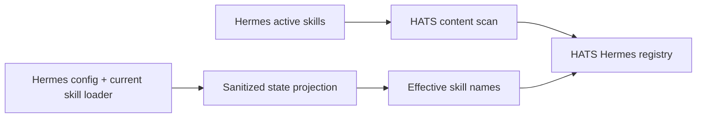

# Skills

HATS exposes Agent Skills through progressive read-only discovery. Skill content never gains execution authority.

## MCP surface

```text
skills_catalog()
skill_get(skill_id)
skill_read_file(skill_id, relative_path, offset, max_bytes)
```

`skills_catalog` returns compact metadata. `skill_get` loads one bounded first chunk of `SKILL.md`. `skill_read_file` reads supporting files in bounded byte ranges.

Source-qualified IDs avoid cross-source ambiguity:

```text
hermes:host-operations
local:my-skill
```

## Sources

HATS supports `filesystem` and `hermes` skill sources.

```yaml
sources:
  skills:
    - id: local
      type: filesystem
      path: /sources/local-skills
      os_platform: linux

    - id: hermes
      type: hermes
      path: /sources/hermes-skills
      os_platform: linux
      state:
        target: hermes
        python_executable: /usr/bin/python3
        config_path: /home/operator/.hermes/config.yaml
        repo_path: /opt/hermes-agent
        consumer_platform: cli
```

The filesystem provider determines its effective catalog from the configured OS and active environment tags.

The Hermes provider uses the mounted active skill tree for content and a live read-only projection from the configured Hermes target for effective names and enable/disable state.

## Hermes parity



The state projector is shipped by HATS and streamed over the existing bounded SSH target. It returns only:

- global and selected consumer-platform disabled skill names;
- configured external skill directory entries;
- the effective skill names returned by Hermes' own current `skills_list` implementation.

It does not return other Hermes configuration fields or secret values. The projection is queried on each Skills MCP call; no manual synchronization or HATS restart is required after ordinary add, remove, edit or enable/disable changes.

HATS fails closed when Hermes reports an effective skill whose content is not present in the configured HATS content source. This prevents silent drift when a future external or plugin-provided skill becomes active before HATS has a readable content source for it.

The current v1 provider does not follow symlinked skill directories. A Hermes tree that introduces symlinked skill packages fails visibly instead of escaping the configured content boundary.

## Discovery

Discovery is recursive. HATS excludes the same core VCS, dependency and cache directories used by Hermes. When a real skill root contains `SKILL.md`, its immediate `references`, `templates`, `assets` and `scripts` directories are supporting content and are not scanned as standalone skills.

Hermes `_org` mirrors are scanned only when their `.active_org` marker selects an active mirror.

Core frontmatter fields are validated lightly. Unknown frontmatter fields and namespaced metadata are preserved and returned by `skill_get`.

A script inside a skill package remains read-only skill content. It is never registered as a managed HATS tool automatically.

## Content retrieval

`skill_get` returns:

- compact catalog metadata;
- preserved frontmatter;
- provenance metadata;
- relative package path;
- `SKILL.md` hash and size;
- supporting file manifest;
- up to the requested first 128 KiB of `SKILL.md`.

`skill_read_file` supports byte offsets and returns explicit `truncated` and `next_offset` fields. Text is returned as UTF-8. Binary content returns metadata only; HATS does not dump base64 into the model context.

Reads reject absolute paths, traversal and symlinked files. Supporting files above 16 MiB are rejected by v1.

## Provenance

Hermes provenance is derived from the metadata already stored inside its active skill root:

- `.hub/lock.json` → `hub`;
- active `_org` mirror → `org`;
- `.bundled_manifest` → `bundled`;
- otherwise → `local`.

Hub source, identifier and trust metadata are retained when present.
