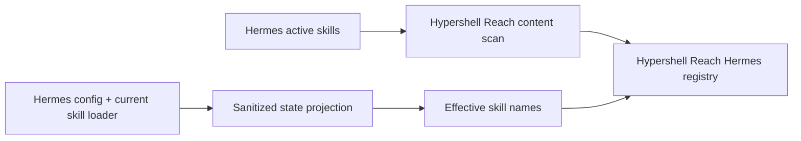

# Skills

Hypershell Reach exposes Agent Skills through progressive read-only discovery. Skill content never gains execution authority.

## MCP surface

```text
skills_catalog()
skill_get(skill_id)
skill_read_file(skill_id, relative_path, offset, max_bytes)
```

`skills_catalog` is the tier-1 discovery surface. It returns only effective skills using the same progressive-disclosure shape as Hermes: source-qualified ID, name, compact description and category, plus the category list, total count and a deterministic `catalog_revision`. Catalog descriptions are capped at 200 characters with an ellipsis when truncated; `skill_get` retains the full validated description and loads up to 128 KiB of `SKILL.md` by default. `skill_read_file` reads supporting files in bounded byte ranges.

The catalog remains derived from live configured state rather than a synchronized copy. Hypershell Reach caches the complete effective registry for 60 seconds, but cache reuse is guarded by a deterministic signature of the configured skill-source definitions and an internal source snapshot. The snapshot contains a deterministic content fingerprint plus a process-local metadata probe over the paths that can affect it. Unchanged probe metadata reuses the cached fingerprint cheaply; any probe change causes a fresh content fingerprint before registry reuse is decided. A source-content change therefore invalidates stale registry state before TTL expiry, while an unchanged source avoids another Hermes projection and registry rebuild. The TTL remains a fallback for effective state that is not represented by mounted source content, such as a remote Hermes enable/disable change. Set `refresh=true` when an explicit immediate rebuild is required.

Source-qualified IDs avoid cross-source ambiguity:

```text
hermes:host-operations
local:my-skill
```

## Sources

Hypershell Reach supports `filesystem` and `hermes` skill sources.

```yaml
sources:
  skills:
    - id: local
      type: filesystem
      path: /sources/local-skills
      os_platform: linux

    - id: hermes
      type: hermes
      path: /sources/hermes-skills
      additional_paths:
        - /sources/private-deployment-project-skills
      os_platform: linux
      state:
        target: hermes
        python_executable: /opt/hermes-agent/venv/bin/python
        config_path: /home/operator/.hermes/config.yaml
        repo_path: /opt/hermes-agent
        consumer_platform: cli
```

The filesystem provider determines its effective catalog from the configured OS and active environment tags.

The Hermes provider uses the mounted active skill tree for content and a live read-only projection from the configured Hermes target for effective names and enable/disable state. `additional_paths` can explicitly add mounted external or trusted project skill roots to the same logical Hermes source. The primary `path` has precedence, followed by `additional_paths` in configured order; a same-named skill in a later content root is ignored. Filesystem sources do not accept `additional_paths`.

## Hermes parity



The state projector is shipped by Hypershell Reach and streamed over the existing bounded SSH target. It returns only:

- global and selected consumer-platform disabled skill names;
- configured external skill directory entries;
- the effective skill names returned by Hermes' own current `skills_list` implementation.

It does not return other Hermes configuration fields or secret values. The projection is queried when the effective-registry cache is cold, when configured source definitions or effective source content invalidate the cache, when the 60-second TTL expires, or when a caller explicitly requests `refresh=true`. No manual synchronization or Hypershell Reach restart is required after ordinary source-content changes. A remote Hermes-only enable/disable change remains bounded by the TTL unless the caller requests an explicit refresh.

Hypershell Reach fails closed when Hermes reports an effective skill whose content is not present in any configured content root for that Hermes source. This prevents silent drift when a future external, project or plugin-provided skill becomes active before Hypershell Reach has an explicitly mounted readable content source for it.

The current v1 provider does not follow symlinked skill directories. A Hermes tree that introduces symlinked skill packages must expose the real package through an explicit mounted `additional_paths` entry instead of escaping the configured content boundary through the symlink.

## Discovery

Discovery is recursive. Hypershell Reach excludes the same core VCS, dependency and cache directories used by Hermes. When a real skill root contains `SKILL.md`, its immediate `references`, `templates`, `assets` and `scripts` directories are supporting content and are not scanned as standalone skills.

Hermes `_org` mirrors are scanned only when their `.active_org` marker selects an active mirror.

Core frontmatter fields are validated lightly. Unknown frontmatter fields and namespaced metadata are preserved and returned by `skill_get`.

A script inside a skill package remains read-only skill content. It is never registered as a managed Hypershell Reach tool automatically.

## Content retrieval

A consumer should load `skills_catalog` once when it needs current discovery, then call `skill_get` only for skills relevant to the current work. Reuse an already-discovered catalog while its revision remains valid. A change in client-side task scope is an applicability decision and does not by itself require catalog rediscovery. If context compression or handoff creates uncertainty about one previously loaded skill, reload only that skill with `skill_get`; the catalog does not need rediscovery merely because model context changed. Hypershell Reach stores no server-side conversation, session or "currently loaded skills" state.

Three hashes have deliberately separate meanings:

- `catalog_revision` is client-visible and hashes only the deterministic effective catalog summary (`id`, `name`, compact description and category);
- each skill `sha256` is the existing SHA-256 of its normalized `SKILL.md` content;
- the effective-source freshness fingerprint is internal cache state and hashes source-qualified package paths plus raw file content, including supporting files and Hermes discovery/provenance metadata. It is not another client-visible version.

Filesystem timestamps, inode numbers, ownership and modes do not affect the deterministic content fingerprint. They are used only by the process-local cheap probe to decide when that fingerprint must be recomputed. Added, removed or renamed package files do affect the fingerprint. Freshness scans reject symlinked source/skill structures consistently with normal discovery and are bounded to 20,000 hashed files, 512 MiB of package content and 50,000 tracked probe paths per snapshot.

`skill_get` returns:

- compact catalog metadata;
- preserved frontmatter;
- provenance metadata;
- relative package path;
- `SKILL.md` hash and size;
- supporting file manifest;
- up to the requested first 128 KiB of `SKILL.md`.

`skill_read_file` supports byte offsets and returns explicit `truncated` and `next_offset` fields. Text is returned as UTF-8. Binary content returns metadata only; Hypershell Reach does not dump base64 into the model context.

Reads reject absolute paths, traversal and symlinked files. Supporting files above 16 MiB are rejected by v1.

## Provenance

Hermes provenance is derived from the metadata already stored inside its active skill root:

- `.hub/lock.json` → `hub`;
- active `_org` mirror → `org`;
- `.bundled_manifest` → `bundled`;
- otherwise → `local`.

Hub source, identifier and trust metadata are retained when present.
