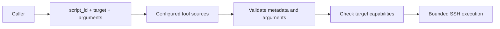

# Tool contracts

HATS exposes raw bounded execution and registry-backed managed tools. Managed tools are the preferred surface for repeatable homelab operations. Sources can be package-bundled or deployment-owned filesystem directories.

## Managed tool flow



The caller cannot select a source path, interpreter, raw argv or environment variables.

## `list_scripts`

Returns compact metadata for all registered scripts. Tool sources are rescanned on each registry call, so source changes do not require a registry database or manual synchronization.

Duplicate script IDs are rejected. They do not use source precedence.

## `get_script`

Returns one script's metadata, source ID, relative path, content hash, size, timeout and typed argument contract. Source code is not returned.

## `run_script`

Inputs:

- `script_id`
- `target`
- `arguments`

The server resolves the exact registered script, validates arguments, checks required target capabilities and sends the script content over SSH stdin. The target does not need a repository checkout.

The script-owned `timeout_seconds` cannot exceed the configured target maximum. Scripts are never retried automatically.

Arguments become deterministic `--kebab-name value` pairs in metadata order. String values are shell-quoted by HATS before the remote interpreter is invoked. The caller cannot supply raw argv.

## Script frontmatter

Managed scripts use YAML frontmatter stored as comments at the start of a `.sh` or `.py` file. A shebang may appear before the opening marker.

```bash
#!/usr/bin/env bash
# ---
# id: system.echo
# name: Echo
# description: Echo one bounded message.
# domain: system
# interpreter: bash
# requires: [linux]
# mutating: false
# idempotent: true
# timeout_seconds: 15
# arguments:
#   - name: message
#     type: string
#     required: true
#     max_length: 256
# ---
```

Required metadata:

| Field | Meaning |
| --- | --- |
| `id` | Global tool ID. Must start with `<domain>.`. |
| `name` | Short display name. |
| `description` | Technical purpose. |
| `domain` | Stable functional domain. |
| `interpreter` | `sh`, `bash` or `python3`. |
| `requires` | Additional target capabilities. |
| `mutating` | Whether normal execution can change state. |
| `idempotent` | Whether repeating the same operation is intended to be safe. |
| `timeout_seconds` | Fixed execution timeout for the managed script. |
| `arguments` | Ordered typed argument definitions. |

The interpreter adds its own required capability automatically. A Bash script therefore requires `bash` even when `requires` only lists `linux`.

### Arguments

Supported v1 types are `string`, `integer` and `boolean`.

String arguments may define `enum`, `pattern`, `min_length` and `max_length`. Integer arguments may define `minimum` and `maximum`. Optional arguments are omitted from argv when absent. Unknown arguments fail validation.

Strings without an explicit `max_length` are limited to 4096 characters.

## Source safety

Discovery is recursive but does not traverse common VCS, dependency or cache directories. Managed script files and discovered subdirectories must not be symlinks. Scripts larger than 256 KiB and frontmatter larger than 16 KiB are rejected.

Files without HATS frontmatter are ignored.

## Bundled tools

Bundled tools are versioned with the HATS package and enabled only when configuration includes a `type: bundled` tool source.

### `performance.host-preflight`

Performs a read-only Linux host-load admission check before representative performance measurements. It samples aggregate CPU and normalized one-minute load and can include bounded `docker stats` CPU diagnostics when Docker is available or required.

The default gates match the migrated Agent Tooling contract: 50% aggregate CPU, 75% one-minute load per logical CPU and 25% for any reported container. `interval_ms` replaces the legacy free-form fractional-seconds argument so the HATS v1 contract remains integer-typed and bounded. The tool writes no result file; HATS Run state owns execution metadata.

Exit `0` means the measurement window is ready, `1` means the window is busy and `2` means a required local metric boundary failed.

### `git.summary-bounded`

Produces a bounded read-only Git work-tree summary. It uses a temporary `HOME`, `GIT_CONFIG_GLOBAL=/dev/null`, `GIT_OPTIONAL_LOCKS=0` and a command-scoped `safe.directory` override, preserving the isolation contract migrated from Agent Tooling without its shared shell-library dependency.

The caller supplies an absolute repository path and may bound status and `diff --check` diagnostics or require a clean work tree. The result includes branch/HEAD/upstream state, ahead/behind counts, staged/unstaged/untracked/conflict counts, bounded status and diagnostics, and compact-stat line counts. The tool writes no result file; MCP output and HATS Run state own transport and execution metadata.

Exit `0` means the requested Git policy passed, `1` means the repository is dirty when cleanliness was required or `diff --check` failed, and `2` means preflight or local Git execution failed.

## Raw execution

### `run_command`

Runs one non-interactive command on one configured target. The requested timeout cannot exceed the target maximum. Commands are never retried automatically.

### `run_shell`

Runs bounded `sh` or `bash` input over SSH stdin. Use it when a managed tool does not yet exist and the caller is authorized to use raw execution.
