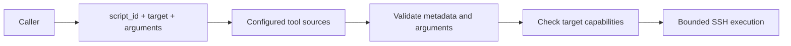

# Tool contracts

HATS exposes raw bounded execution and registry-backed managed tools. Managed tools are the preferred surface for repeatable homelab operations. Sources can be package-bundled or deployment-owned filesystem directories.

## Managed tool flow



The caller cannot select a source path, interpreter, raw argv or environment variables.

## `list_scripts`

Returns compact metadata for all registered scripts. Tool sources are rescanned on each registry call, so source changes do not require a registry database or manual synchronization.

Duplicate script IDs are rejected. They do not use source precedence.

## `get_script`

Returns one script's metadata, source ID, relative path, content hash, size, timeout and typed argument contract. Source code is not returned.

## `run_script`

Inputs:

- `script_id`
- `target`
- `arguments`

The server resolves the exact registered script, validates arguments, checks required target capabilities and sends the script content over SSH stdin. The target does not need a repository checkout.

The script-owned `timeout_seconds` cannot exceed the configured target maximum. Scripts are never retried automatically.

Arguments become deterministic `--kebab-name value` pairs in metadata order. `string_list` values repeat the same flag once per item, preserving list order. String values are shell-quoted by HATS before the remote interpreter is invoked. The caller cannot supply raw argv.

## Script frontmatter

Managed scripts use YAML frontmatter stored as comments at the start of a `.sh` or `.py` file. A shebang may appear before the opening marker.

```bash
#!/usr/bin/env bash
# ---
# id: system.echo
# name: Echo
# description: Echo one bounded message.
# domain: system
# interpreter: bash
# requires: [linux]
# mutating: false
# idempotent: true
# timeout_seconds: 15
# arguments:
#   - name: message
#     type: string
#     required: true
#     max_length: 256
# ---
```

Required metadata:

| Field | Meaning |
| --- | --- |
| `id` | Global tool ID. Must start with `<domain>.`. |
| `name` | Short display name. |
| `description` | Technical purpose. |
| `domain` | Stable functional domain. |
| `interpreter` | `sh`, `bash` or `python3`. |
| `requires` | Additional target capabilities. |
| `mutating` | Whether normal execution can change state. |
| `idempotent` | Whether repeating the same operation is intended to be safe. |
| `timeout_seconds` | Fixed execution timeout for the managed script. |
| `arguments` | Ordered typed argument definitions. |

The interpreter adds its own required capability automatically. A Bash script therefore requires `bash` even when `requires` only lists `linux`.

### Arguments

Supported v1 types are `string`, `string_list`, `integer` and `boolean`.

String and `string_list` items may define `enum`, `pattern`, `min_length` and `max_length`. A `string_list` may additionally define `min_items` and `max_items`; absent bounds default to 1 and 64. HATS serializes each item as a repeated flag rather than flattening the list into one string. Integer arguments may define `minimum` and `maximum`. Optional arguments are omitted from argv when absent. Unknown arguments fail validation.

Strings and list items without an explicit `max_length` are limited to 4096 characters.

## Source safety

Discovery is recursive but does not traverse common VCS, dependency or cache directories. Managed script files and discovered subdirectories must not be symlinks. Scripts larger than 256 KiB and frontmatter larger than 16 KiB are rejected.

Files without HATS frontmatter are ignored.

## Bundled tools

Bundled tools are versioned with the HATS package and enabled only when configuration includes a `type: bundled` tool source.

### `performance.host-preflight`

Performs a read-only Linux host-load admission check before representative performance measurements. It samples aggregate CPU and normalized one-minute load and can include bounded `docker stats` CPU diagnostics when Docker is available or required.

The default gates match the migrated Agent Tooling contract: 50% aggregate CPU, 75% one-minute load per logical CPU and 25% for any reported container. `interval_ms` replaces the legacy free-form fractional-seconds argument so the HATS v1 contract remains integer-typed and bounded. The tool writes no result file; HATS Run state owns execution metadata.

Exit `0` means the measurement window is ready, `1` means the window is busy and `2` means a required local metric boundary failed.

### `git.summary-bounded`

Produces a bounded read-only Git work-tree summary. It uses a temporary `HOME`, `GIT_CONFIG_GLOBAL=/dev/null`, `GIT_OPTIONAL_LOCKS=0` and a command-scoped `safe.directory` override, preserving the isolation contract migrated from Agent Tooling without its shared shell-library dependency.

The caller supplies an absolute repository path and may bound status and `diff --check` diagnostics or require a clean work tree. The result includes branch/HEAD/upstream state, ahead/behind counts, staged/unstaged/untracked/conflict counts, bounded status and diagnostics, and compact-stat line counts. The tool writes no result file; MCP output and HATS Run state own transport and execution metadata.

Exit `0` means the requested Git policy passed, `1` means the repository is dirty when cleanliness was required or `diff --check` failed, and `2` means preflight or local Git execution failed.

### `filesystem.snapshot-modes`

Writes the existing `agent-tooling-file-modes-v1` tab-separated mode/type contract for one to 256 explicit absolute paths. The target paths themselves are never modified, but creating or replacing the snapshot file is a mutation, so this tool is intentionally separate from comparison and is recorded by HATS with `mutating=true` and `idempotent=false`. Existing snapshots are refused unless `force=true` is explicitly supplied.

### `filesystem.compare-modes`

Reads an `agent-tooling-file-modes-v1` snapshot and compares up to 256 entries against current mode/type state without mutation. Legacy v1 snapshots remain compatible. Exit `0` means every entry matches, `1` means one or more mode/type mismatches were detected, and `2` means the snapshot contract or local read boundary is invalid.

Unlike the legacy helper, comparison returns JSON only through stdout; HATS owns output transport and Run metadata, so a second `--json-output` write path is unnecessary.

### `filesystem.literal-match-count`

Counts an exact byte sequence from one bounded needle file inside another bounded file and asserts the expected count. It is intended for pre-change anchor checks where textual normalization would be unsafe. Both paths must be absolute; the target is capped at 16 MiB and the needle at 1 MiB. Empty needles are rejected.

Exit `0` means the exact count matched, `1` means the observed count differed and `2` means the local file contract was invalid. The tool is read-only and replaces the literal match-count mode from the legacy Compose preflight without coupling that generic filesystem check to Docker Compose.

## Task tools

### `list_tasks` / `get_task`

Read active or archived Task continuity records. Task v1 YAML remains readable without an implicit rewrite. Task v2 records expose a monotonic `revision`; compact listings include both `schema_version` and `revision`.

### `create_task`

Creates a Task v2 record at revision `1` in the configured active Task root. A Task record contains logical continuity state only: it does not persist its filesystem path, an evidence path, secrets, or Run backlinks. New Tasks do not create an `evidence/` directory.

### `update_task`

Applies a typed partial update to one Task. Callers that perform read-modify-write flows should supply `expected_revision`; a stale value is rejected before state is committed. The argument remains optional for compatibility with the pre-v2 MCP contract, while all writes are serialized by a per-Task interprocess lock. A terminal `status` routes through the same server-owned close boundary as `close_task`, so a successful terminal update cannot leave the Task in the active root.

### `close_task`

Closes one Task as `completed` or `cancelled`. The server owns the complete boundary: final Task validation, revision increment, durable YAML replacement, Task-directory move to the archive root, and required directory fsyncs. Retrying the same committed final state is idempotent, including recovery when the final record or archive rename committed before the caller received success.

### `archive_task`

Backward-compatible terminal archival helper. It remains idempotent for callers using the previous two-step contract, but new callers should use `close_task` or a terminal `update_task`. Open Tasks cannot be archived.

## Candidate tools

### `tooling_candidates`

Backward-compatible read-only view of explicit candidates from the optional legacy Markdown tooling registry. Its result shape is retained for existing consumers.

### `preview_candidate_imports`

Read-only compatibility adapter from `tooling-registry-v1` to incomplete `candidate-v1` drafts. It copies only explicit legacy fields, reports missing required Candidate fields, and never mutates state.

### `list_candidates` / `get_candidate`

Read HATS-owned Candidate YAML state when `workspace.candidates` is configured. `list_candidates` may filter by the six-state Candidate lifecycle.

### `create_candidate`

Creates revision `1` with state `candidate`. Required proposal content includes problem/cause/recurrence/evidence, capability, typed input/output descriptions, safety boundary, acceptance postconditions, ownership and promotion rationale. There is no arbitrary document mutation API.

### `update_candidate`

Updates proposal content only and requires `expected_revision`. Lifecycle state is deliberately absent from this input contract, so approval cannot be smuggled through a generic update.

### `approve_candidate`

Transitions an eligible Candidate to `approved` with `expected_revision` and an approval rationale. Callers may invoke it only after explicit operator authorization. HATS validates state mechanics; availability of this tool is not authorization.

### `block_candidate` / `mark_candidate_not_warranted`

Typed state transitions that require `expected_revision` and preserve the original promotion rationale alongside the transition rationale.

### `link_candidate_task`

Links an approved or subsequently blocked Candidate to an existing HATS Task using the Task ID. The Candidate stores no Task filesystem path.

### `complete_candidate`

Transitions an approved Candidate to `implemented` or `automated` and requires a final `managed-tool` or `capability` reference. A `managed-tool` reference must resolve in the current effective ToolRegistry before state is committed.

## Raw execution

### `run_command`

Runs one non-interactive command on one configured target. The requested timeout cannot exceed the target maximum. Commands are never retried automatically.

### `run_shell`

Runs bounded `sh` or `bash` input over SSH stdin. Use it when a managed tool does not yet exist and the caller is authorized to use raw execution.
